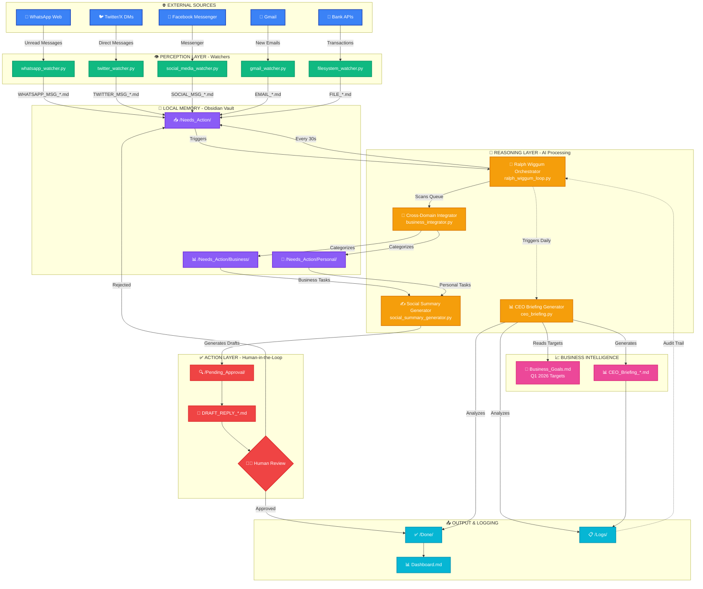

<div align="center">

# 🤖 AI Employee Vault
### Gold Tier Achievement - AI Employee Hackathon

[](https://git.io/typing-svg)

[](https://www.python.org/)
[](https://playwright.dev/)
[](https://obsidian.md/)
[](https://www.anthropic.com/)

**From Reactive Chatbot to Proactive Digital Employee**

</div>

---

## 🎯 The Vision

> **This is not a chatbot. This is a digital employee.**

Transform Claude from a reactive assistant into a **fully autonomous AI employee** that monitors your digital life 24/7, categorizes tasks, generates professional responses, and provides executive-level business intelligence—all while maintaining human oversight through strategic safety gates.

Built with **Claude Code**, **Obsidian**, **Python**, **Playwright**, and **Model Context Protocol (MCP)**.

---

## 🏗️ Master Architecture Diagram



---

## 🥉 Bronze Tier: File Watchers & Basic Triage

> **The Foundation: Automated Inbox Zero**

The Bronze Tier establishes the core file-watching infrastructure that transforms your Obsidian vault into an intelligent inbox.

### ✨ Key Features

🔍 **Local File Watchers**
- Monitors designated folders for new files (emails, alerts, documents)
- Triggers Claude Code automatically when new files appear
- Zero-latency response to incoming tasks

📂 **Smart File Routing**
- `ALERT_*.md` files → System alerts and notifications
- `EMAIL_*.md` files → Email content requiring action
- `FILE_*.md` files → Documents and general files

🎯 **Automated Triage**
- Reads incoming file content
- Categorizes by type and urgency
- Routes to appropriate subfolder in `/Done`
- Updates `Dashboard.md` with activity metrics
- Logs all actions for audit trail

### 🔄 Bronze Tier Workflow

```
New File Detected → Claude Reads Content → Categorize & Route → Update Dashboard → STOP
```

**Trigger Command:** `Process tasks`

**Result:** Your digital inbox stays at zero without manual intervention.

---

## 🥈 Silver Tier: Human-In-The-Loop & Browser MCP Automation

> **The Safety Layer: Autonomous with Oversight**

The Silver Tier introduces intelligent decision-making and external automation while maintaining human control over critical actions.

### ✨ Key Features

✅ **Human-In-The-Loop (HITL) Safety Gate**
- Complex actions (social media posts, client emails) require approval
- AI generates draft content and saves to `/Pending_Approval`
- Human reviews and moves to `/Approved` when ready
- Prevents accidental or inappropriate automated actions

🌐 **Browser MCP Integration**
- Uses Model Context Protocol for browser automation
- Persistent browser sessions (login once, automate forever)
- Executes approved actions via Playwright/Puppeteer
- LinkedIn posting, form filling, web scraping

⏰ **Scheduled Task Execution**
- Morning briefings triggered by file watchers
- Recurring tasks automated via scheduled file drops
- Time-based workflows without cron jobs

### 🔄 Silver Tier Workflow

```
Complex Task → AI Generates Draft → Save to /Pending_Approval → Human Reviews →
Move to /Approved → Execute via MCP → Move to /Done → Update Dashboard → STOP
```

**Trigger Commands:**
- `Process tasks` - Generate drafts for approval
- `Execute approved` - Run approved automation scripts

**Result:** Autonomous AI with human oversight on critical decisions.

---

## 🥇 Gold Tier: Business Intelligence & True Autonomy

> **The Revolution: A Self-Managing Digital Employee**

The Gold Tier transforms the vault into a fully autonomous AI employee with business intelligence, cross-domain integration, and continuous operation.

### ✨ Key Features

#### 🔀 1. Business Integrator (Cross-Domain Intelligence Engine)
**File:** `Scripts/business_integrator.py`

Automatically categorizes all incoming tasks into Business and Personal domains using advanced keyword analysis and pattern recognition.

- 🔍 Scans `/Needs_Action` for new `.md` files
- 🏷️ Classifies as Business (client, revenue, projects) or Personal (family, health, hobbies)
- 📁 Moves files to `/Needs_Action/Business/` or `/Needs_Action/Personal/`
- 📊 Enables domain-specific processing and metrics

**Trigger:** Runs automatically as first step in task processing

---

#### 📱 2. Triple-Threat Social Media Monitoring System

**Files:** `social_media_watcher.py`, `whatsapp_watcher.py`, `twitter_watcher.py`, `Scripts/social_summary_generator.py`

24/7 monitoring across Facebook, WhatsApp, and Twitter/X for business-critical messages with AI-powered response generation.

**📘 Facebook Watcher** (`social_media_watcher.py`)
- Monitors Facebook Messenger continuously
- Scans for keywords: `client`, `urgent`, `sale`, `project`, `pricing`
- Creates `SOCIAL_MSG_<timestamp>.md` files in `/Needs_Action/Business/`
- Persistent session: `/user_data/facebook_session/`

**💬 WhatsApp Watcher** (`whatsapp_watcher.py`)
- Monitors WhatsApp Web for unread messages
- Keywords: `urgent`, `asap`, `invoice`, `payment`, `help`, `client`
- Creates `WHATSAPP_MSG_<timestamp>.md` files in `/Needs_Action/Business/`
- Persistent session: `/user_data/whatsapp_session/`
- QR code authentication on first run

**🐦 Twitter/X Watcher** (`twitter_watcher.py`)
- Monitors Twitter/X Direct Messages
- Keywords: `client`, `project`, `sale`, `urgent`, `business`, `opportunity`
- Creates `TWITTER_MSG_<timestamp>.md` files in `/Needs_Action/Business/`
- Persistent session: `/user_data/twitter_session/`

**✍️ Enhanced Social Summary Generator**
- **Multi-platform support:** Processes `SOCIAL_MSG_*`, `TWITTER_MSG_*`, and `WHATSAPP_MSG_*` files
- Generates highly professional, context-aware draft replies
- Platform-specific response formatting
- Advanced templates for:
  - ⚡ Urgent/ASAP requests → Immediate availability response
  - 💰 Invoice/payment inquiries → Professional acknowledgment
  - 🆘 Help requests → Supportive assistance offer
  - 💵 Pricing inquiries → Proposal template
  - 📋 Project discussions → Discovery call invitation
  - 🤝 Client acquisition → Professional engagement
- Saves drafts to `/Pending_Approval/` (HITL safety gate)
- Moves processed messages to `/Done/Data/`

**Trigger Commands:**
```bash
python social_media_watcher.py  # Start Facebook monitoring
python whatsapp_watcher.py      # Start WhatsApp monitoring
python twitter_watcher.py       # Start Twitter/X monitoring
```
```
Process social  # Generate draft replies for all platforms
```

---

#### 📊 3. CEO Briefing Generator
**File:** `Scripts/ceo_briefing.py`

Executive-level business intelligence reporting with revenue tracking, priority analysis, and proactive business suggestions.

**Features:**
- 🎯 Reads `Business_Goals.md` for targets and KPIs
- 💰 Scans `/Done` and `/Logs` to calculate revenue and task completion
- 📝 Generates professional `CEO_Briefing_<date>.md` in `/Logs`

**Report Includes:**
- 📋 Executive Summary
- 💵 Revenue vs. Target (with percentage and gap analysis)
- ✅ Completed Tasks breakdown by category
- 🚧 Bottleneck identification
- 💡 Proactive business suggestions
- 📊 Active project tracking
- ➡️ Next steps recommendations

**Trigger Command:** `Generate briefing`

---

#### 🔄 4. Master Orchestrator Loop (Ralph Wiggum Hook)
**File:** `Scripts/ralph_wiggum_loop.py`

The crown jewel: a continuous autonomous loop that ensures the AI keeps working until all tasks are processed across all platforms.

> **"I'm helping! I'm helping!"** - Ralph Wiggum

**Features:**
- ♾️ Runs in infinite `while True` loop
- 👀 Monitors `/Needs_Action` and all subfolders every 30 seconds
- 🤖 When tasks detected: automatically executes processing pipeline
  1. Gmail Watcher
  2. WhatsApp Watcher
  3. Twitter Watcher
  4. Facebook Watcher
  5. Business Integrator
  6. Social Summary Generator
  7. CEO Briefing Generator
- 😴 When queue empty: "Ralph Wiggum hook activated. Waiting for new tasks..."
- ⏹️ Continues until manually stopped (Ctrl+C)

**Trigger Command:**
```bash
python Scripts/ralph_wiggum_loop.py
```

**Result:** True autonomous operation. The AI employee works continuously without human intervention until all folders are clean.

---

### 🔄 Gold Tier Workflow

```
Orchestrator Loop Running →
  Check /Needs_Action →
    If Tasks Found:
      Run Cross-Domain Integrator →
      Run Social Summary Generator →
      Update Dashboard →
      Check Again in 5 seconds
    If Queue Empty:
      Ralph Wiggum Hook Activated →
      Wait 30 seconds →
      Check Again
  → Repeat Forever
```

---

## 🔐 Security & Privacy

### 🏠 Local-First Architecture

> **Your data never leaves your machine.**

This system is built on a **local-first philosophy** that prioritizes privacy and security:

- 🔒 **No Cloud Dependencies** - Core functionality runs entirely on your local machine
- 💾 **Local Storage Only** - All data stored in your Obsidian vault (markdown files)
- 🔑 **You Control Your Data** - No third-party servers, no data mining, no tracking
- ✈️ **Offline Capable** - Works without internet (except browser automation)
- 🔐 **Encrypted Sessions** - Browser sessions stored locally with encryption

### 🛡️ Strict .gitignore Sanitization

To prevent accidental exposure of sensitive data, this repository includes comprehensive `.gitignore` rules:

```gitignore
# Browser sessions and authentication data (CRITICAL)
user_data/
/user_data/

# OAuth and authentication credentials
credentials.json
token.json

# Environment variables and API keys
.env
.env.local
*.env

# Claude Code configuration (may contain API keys)
.claude/
/.claude/

# Logs with potentially sensitive data
*.log
```

**What's Protected:**
- 🔐 Browser session data (Gmail, Facebook, WhatsApp, Twitter)
- 🔑 OAuth tokens and API credentials
- 📧 Personal email content and messages
- 💬 Social media conversations
- 📊 Business intelligence reports with revenue data

**What's Shared:**
- ✅ Python scripts (watchers, integrators, generators)
- ✅ Folder structure and architecture
- ✅ Documentation and setup guides
- ✅ Configuration templates (without secrets)

### 🚨 Human-in-the-Loop Safety Gates

Even with local-first architecture, we implement **strategic safety gates** to prevent unintended actions:

- ✅ All AI-generated responses saved to `/Pending_Approval/` first
- 👨‍💼 Human review required before sending messages
- 🚫 No automated posting without explicit approval
- 📋 Full audit trail in `/Logs/` for accountability

---

## 🚀 Installation & Setup

### Prerequisites

- **Claude Code CLI** (Anthropic's official CLI tool)
- **Python 3.8+**
- **Obsidian** (for vault management)
- **Playwright** (for browser automation)

### Quick Start

1. **Clone this repository**
   ```bash
   git clone <your-repo-url>
   cd AI_Employee_Vault
   ```

2. **Install Python dependencies**
   ```bash
   pip install playwright
   ```

3. **Install Playwright browsers**
   ```bash
   playwright install chromium
   ```

4. **Configure Business Goals**
   - Edit `Business_Goals.md` with your Q1 2026 targets

5. **Authenticate each watcher** (first-time only)
   ```bash
   python gmail_watcher.py           # Log into Gmail
   python whatsapp_watcher.py        # Scan WhatsApp QR code
   python twitter_watcher.py         # Log into Twitter/X
   python social_media_watcher.py   # Log into Facebook
   ```

6. **Start the master orchestrator**
   ```bash
   python Scripts/ralph_wiggum_loop.py
   ```

7. **Watch your AI employee work autonomously** across all platforms 🎉

---

## 💡 Key Innovations

### 1️⃣ Local-First Architecture
- No cloud dependencies for core functionality
- Your data stays on your machine
- Works offline (except browser automation)

### 2️⃣ File-Based State Management
- No databases required
- Human-readable markdown files
- Easy to audit, backup, and version control

### 3️⃣ Strategic HITL Gates
- Automation where safe (categorization, drafting)
- Human approval where critical (sending messages, posting content)
- Best of both worlds: speed + safety

### 4️⃣ True Autonomy via Ralph Wiggum Loop
- Unlike reactive chatbots, this AI actively seeks work
- Continuous operation until all queues are empty
- Self-managing digital employee

### 5️⃣ Business Intelligence Integration
- Not just task automation—strategic insights
- Revenue tracking, bottleneck identification
- Proactive suggestions for business growth

---

## 🎯 The Paradigm Shift: From Chatbot to Employee

| Traditional AI Assistants (Reactive) | AI Employee Vault (Proactive) |
|--------------------------------------|-------------------------------|
| ⏸️ Wait for user commands | ▶️ Actively monitors for new work |
| 1️⃣ Process one task at a time | ♾️ Processes tasks continuously |
| 🧠 No memory between sessions | 💾 Persistent state across sessions |
| 😴 No proactive behavior | 🚀 Proactive suggestions and alerts |
| 👨‍💼 Human must manage workflow | 🤖 Self-managing workflow |

---

## 🏆 Conclusion

This AI Employee Vault represents a fundamental shift in how we interact with AI. Instead of reactive chatbots that wait for commands, we now have **proactive digital employees** that:

- 👁️ Monitor your digital life 24/7
- 🏷️ Categorize and prioritize incoming work
- ✍️ Generate professional responses automatically
- 📊 Provide executive-level business intelligence
- ♾️ Work continuously until all tasks are complete

The Ralph Wiggum Loop ensures true autonomy: the AI keeps working, keeps helping, keeps processing—until every folder is clean and every task is done.

**This is the future of personal AI automation.**

---

<div align="center">

### 🎉 Gold Tier Achievement Unlocked

**"I'm helping! I'm helping!"** - Ralph Wiggum

Built for the AI Employee Hackathon

[](https://github.com)
[](LICENSE)

</div>
